# Waypoint Project Template Example

This is an example of how to create and use project templating in HCP Waypoint.

Pre-Requisites

AWS Account with Admin Permissions

Terraform Enterprise Account with No Code Module Enabled.

## Initial Setup

### Terraform Module Creation

TODO(Teresa): Make this repo public.

1. Fork the `hashicorp/terraform-aws-example-microservice-ecs-all-envs` repository in Github [here](https://github.com/hashicorp/terraform-aws-example-microservice-ecs-allenvs)


#### Publish The Example  Module
1. Inside Terraform Cloud, Click Registry and Select `Publish a Module`
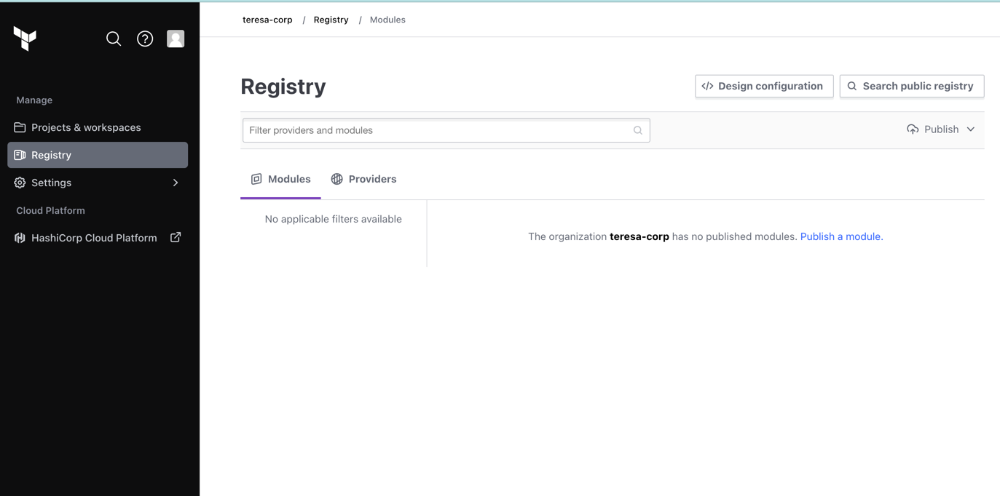


2. Select Github under `Version Control Provider`

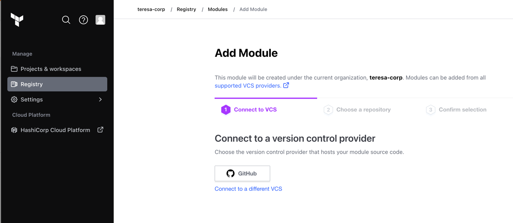

3. Select your forked repository of the no-code module created in the last step.

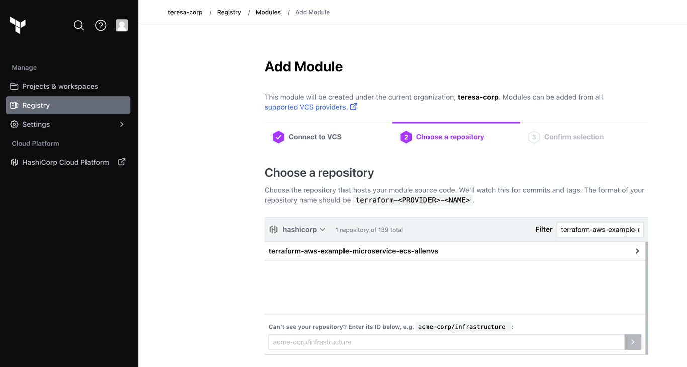

4. Click `Publish Module`

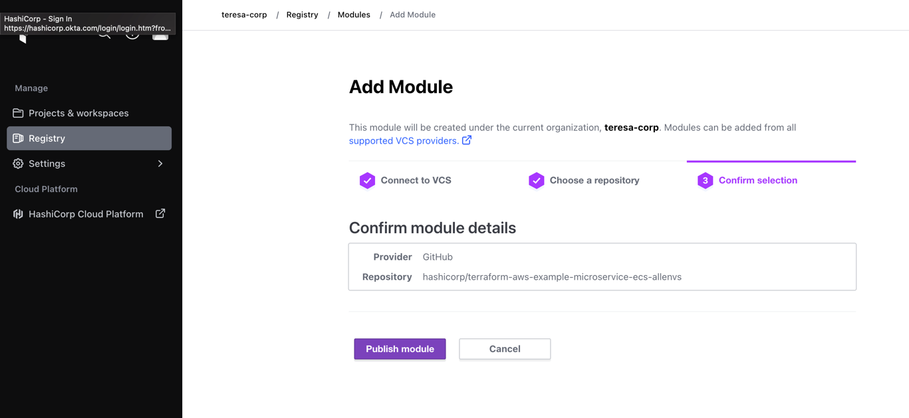

5. Review the published module details

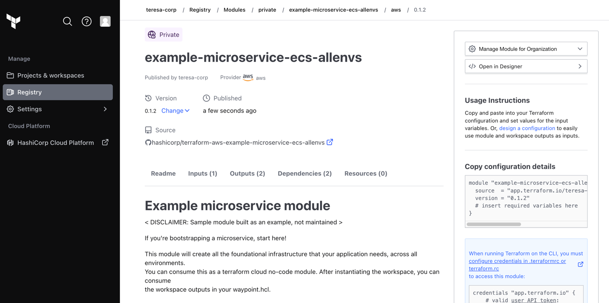


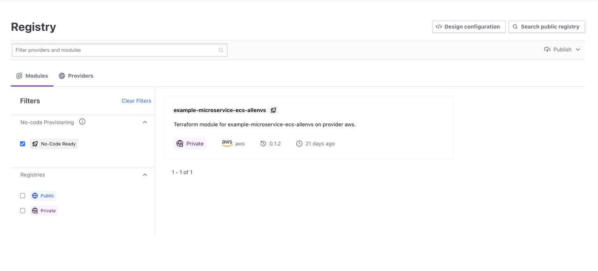

### Terraform Cloud Workspaces

1. Create terraform cloud [workspaces](https://developer.hashicorp.com/terraform/cloud-docs/workspaces/creating) in the TFC User Interface based on the following terraform configurations provided in this example:
        `terraform-aws-example-microservice-infra`
        `terraform-aws-example-network`
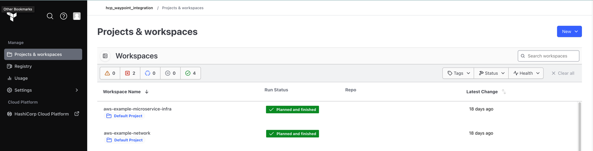


2. Go to Settings for the created TFC workspaces, Under `Remote State Sharing` allow `Share with all workspaces in this organization`.
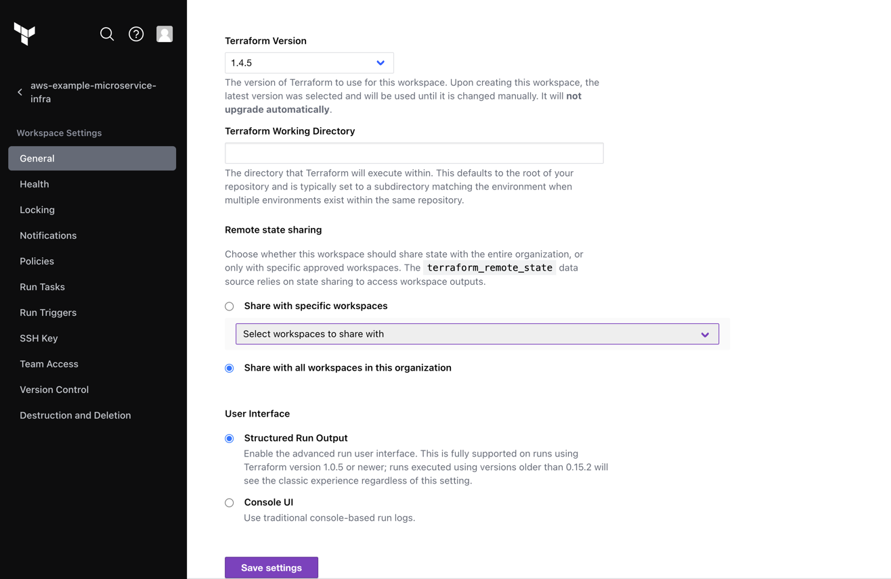


3. Create a [global variable set](https://developer.hashicorp.com/terraform/tutorials/cloud-get-started/cloud-workspace-create#create-the-workspace) for your AWS Credentials.

### AWS Steps with Terraform

Create the baseline infrastructure with the following steps in your CLI.

1. Navigate to the `terraform-aws-example-network` directory found in this example and run `terraform init` and the `terraform apply` command.

2. Navigate to the `terraform-aws-example-microservice-infra` directory found in this example and run `terraform init` and the  `terraform apply` command.


## Waypoint Template Steps 

TODO(Teresa): Replace figma images with proper screenshots once UI is ready.


1. Set up your TFC Credentials in Waypoint. You will need a TFC team access token found in Terraform Cloud and your TFC Organization Name.
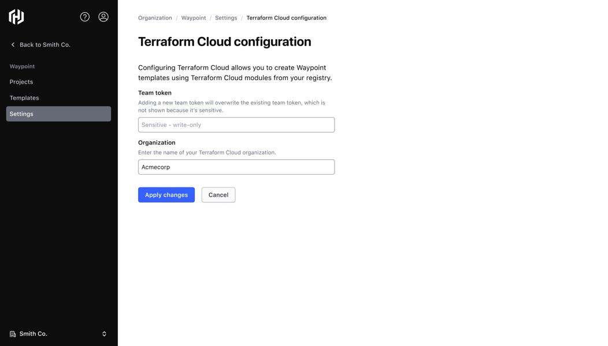


2. Create a Waypoint Project Template by filling in the fields in the Template Creation page:
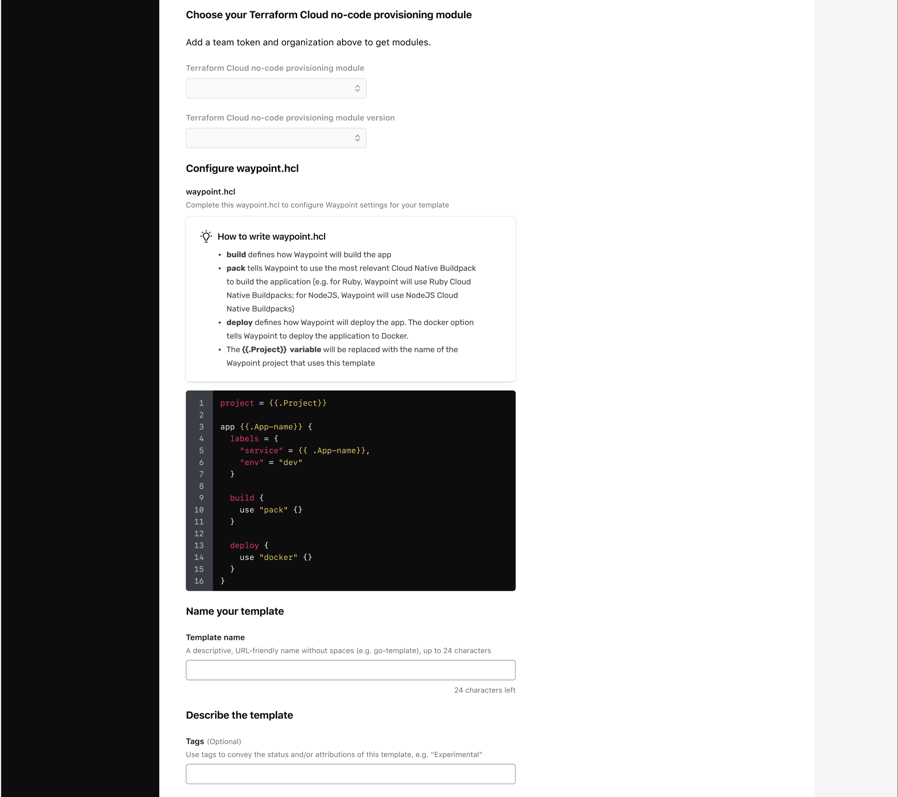


3. Return to your Projects List Page. In the top right corner, select `Create Project`. From the dropdown menu, select `Create Project with template`:
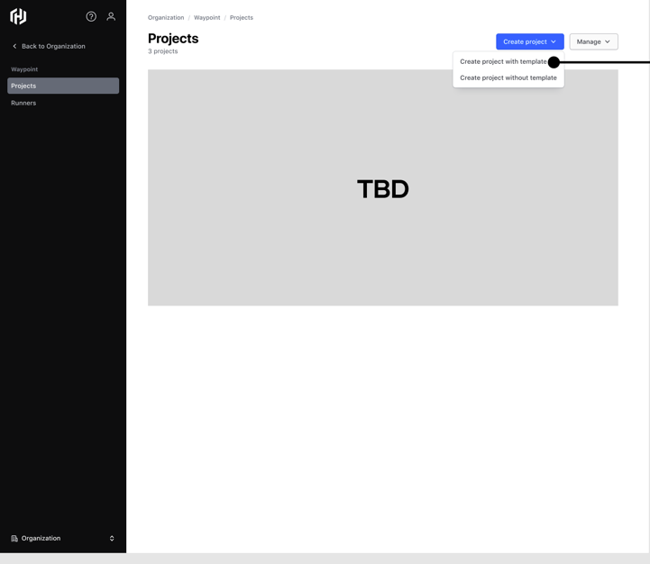

   
4. Select the template you would like to use for this project.
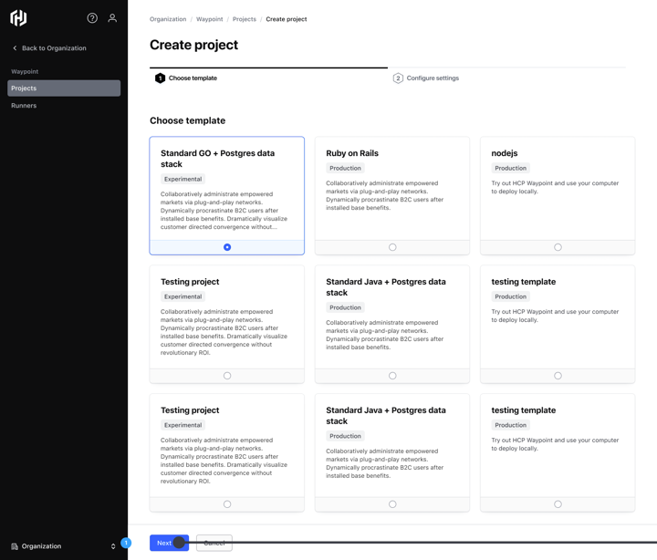
 
   

5. Fill in the name of your project under `Project Name`. Then click `Create Project.
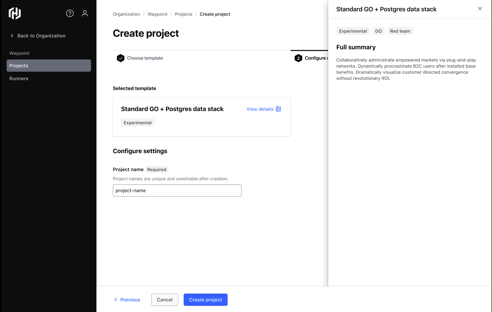

   
6. Review the project details of your newly created project! You're Ready to Go!
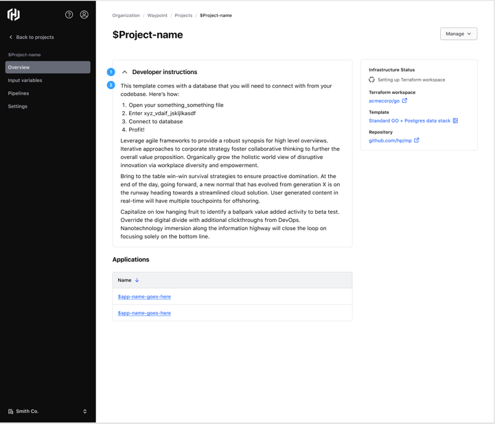


## Waypoint Template Steps via CURL commands

Pre-Requisites
1. Your NamespaceID
2. HCP Waypoint Authentication Token
3. TFC Authentication Token


1. Set up your TFC Credentials in Waypoint

```shell
curl --location --request PUT 'https:// api.hashicorp.cloud:443/waypoint/2022-02-03/namespace/{{NAMESPACE_ID}}/tfcconfig' \
--header 'Authorization: {{YOUR_HCP_Waypoint_AUTH_TOKEN}}' \
--header 'Content-Type: application/json' \
--data '{"tfc_config":{"organization_name":"hcp_waypoint_integration", "token":"{{YOUR_TFC_AUTH_TOKEN}}"}, "namespace_id":"{{NAMESPACE_ID}}"}'


```

2. Create a Waypoint Project Template

```shell
curl --location 'https:// api.hashicorp.cloud:443/waypoint/2022-02-03/namespace/{{NAMESPACE_ID}}/projecttemplate' \
--header 'Authorization: {{YOUR_HCP_Waypoint_AUTH_TOKEN}}' \
--header 'Content-Type: application/json' \
--data '{
  "project_template": {
    "name": "{{SOME_TEMPLATE_NAME}}",
    "summary": "{{SOME_TEMPLATE_SUMMARY}}",
    "readme_markdown_template": "{{SOME_TEMPLATE_README_TEXT}}",
    "waypoint_project": {
      "waypoint_hcl_template": "{{ENCODED_PROJECT_TEMPLATE_BYTES}}"
    },
    "terraform_nocode_module": {
      "source": "private/hcp_waypoint_integration/example-microservice-ecs-allenvs/aws",
      "version": "0.1.2"
    }
  }
}'
```


3. Initialize a Waypoint Project Using the Existing Project Template.

```shell
curl --location 'https:// api.hashicorp.cloud:443/waypoint/2022-02-03/namespace/{{NAMESPACE_ID}}/project/fromtemplate' \
--header 'Authorization: Bearer {{YOUR_HCP_Waypoint_AUTH_TOKEN}}' \
--header 'Content-Type: application/json' \
--data '{
  "project_name": "{{SOME_HCP_WAYPOINT_PROJECT_NAME}}",
  "project_template": {
    "name": "{{PROJECT_TEMPLATE_NAME}}"
  }
}'
```


4. List all Project Templates
```shell
curl --location 'https:// api.hashicorp.cloud:443/waypoint/2022-02-03/namespace/{{NAMESPACE_ID}}/projecttemplates' \
--header 'Authorization: Bearer {{YOUR_HCP_Waypoint_AUTH_TOKEN}}'
```