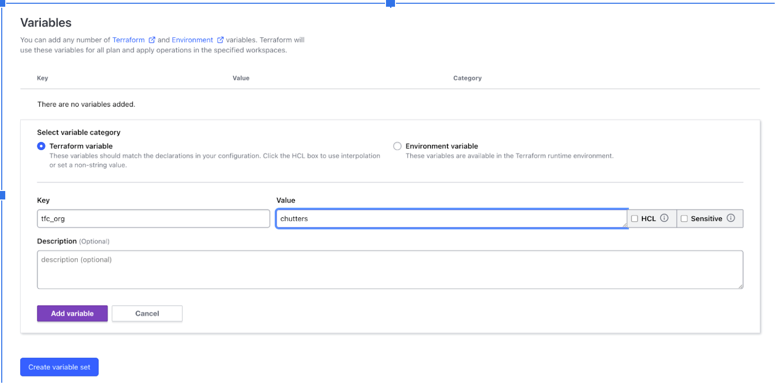
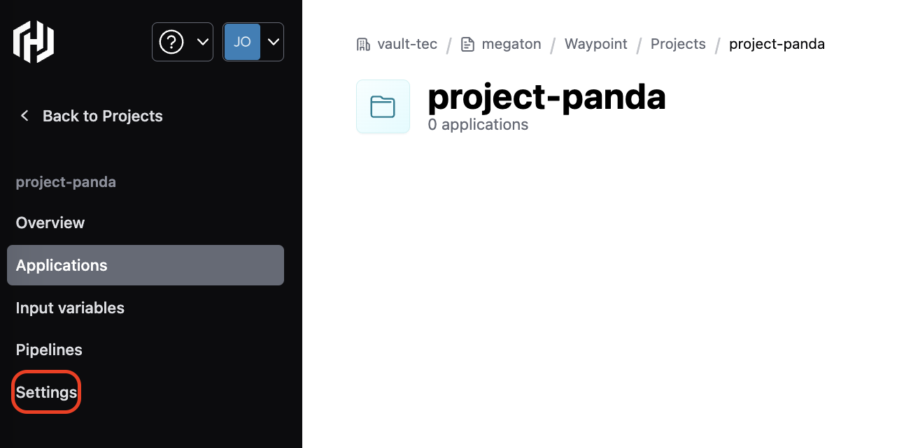
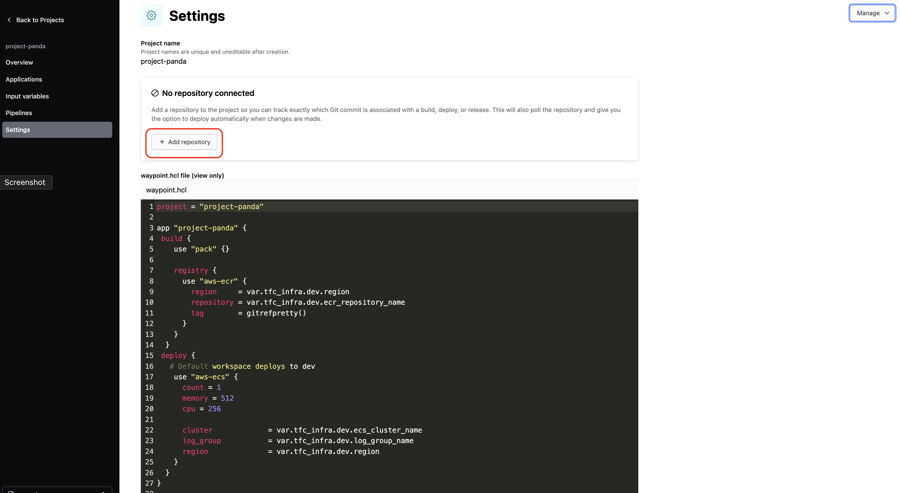
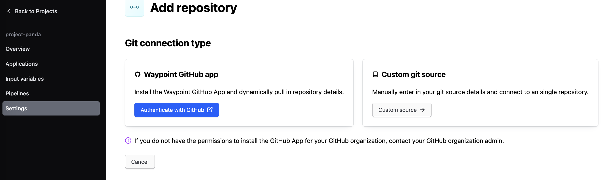
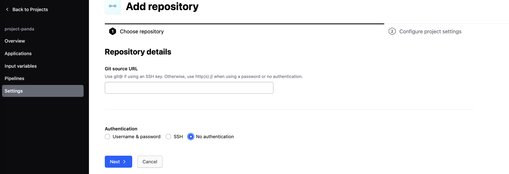
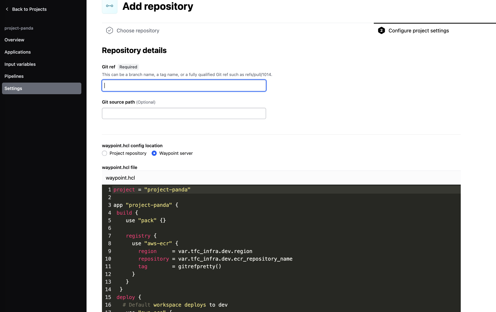
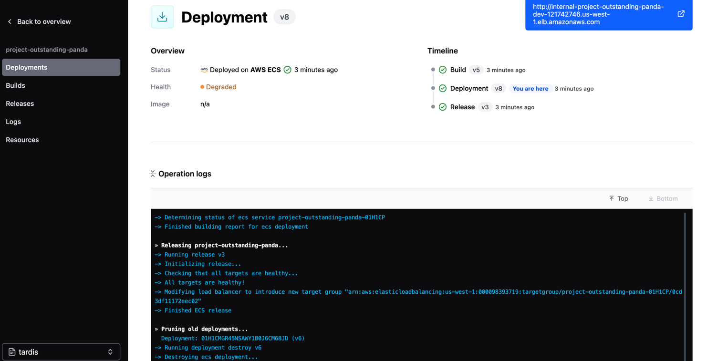

# HCP Waypoint Project Template Example


This is an example of how a platform engineer can create a project template in HCP Waypoint to allow application developers to quickly bootstrap new applications following organizational standards.

Project Templates in HCP Waypoint allow platform engineers to define templates for waypoint projects. Templates contain a templated waypoint.hcl, which defines the app's deployment workflow, and a Terraform [no-code module](https://developer.hashicorp.com/terraform/tutorials/cloud/no-code-provisioning) which creates app-specific infrastructure. App developers can then create new applications using this template quickly and easily, without needing deep awareness of the underlying infrastructure.

In this example, we will configure a project template for AWS ECS microservices with dev and prod environments, and then use it to create and deploy a basic nodejs webapp.

Prerequisites:

- AWS Account with Admin Permissions

- Terraform Enterprise Account with No Code Module Enabled.

## Foundational Infrastructure Setup

### Terraform Cloud Workspaces

1. From [Terraform Cloud](https://app.terraform.io/), select an Organization you can use for testing, or optionally create a new one. We'll reference the Organization name later on in the example. 

1. Create a new [global variable set](https://developer.hashicorp.com/terraform/tutorials/cloud-get-started/cloud-create-variable-set) for your AWS Credentials by going to `Settings > Variable Sets` and enter in the applicable key/value pairs  (`AWS_ACCESS_KEY_ID`, `AWS_SECRET_ACCESS_KEY`, et. al.) using the `Environment variable` category. Ensure `Apply globally` is selected. 

1. Create a second global variable set called `TFC Org Name` and define a [global variable](https://developer.hashicorp.com/terraform/tutorials/cloud-get-started/cloud-workspace-configure#configure-terraform-variables) named `tfc_org` and assign its value as your TFC Organization Name, and its category as `Terraform variable`. 

   


1. Return to Workspaces by clicking `Workspaces` on the left hand side navigation. From here create two new Terraform Cloud [Workspaces](https://developer.hashicorp.com/terraform/cloud-docs/workspaces/creating), which we'll initialize later.
    - Click `New > Workspace` in the top right
    - Select `CLI-driven workflow`
    - For workspace name use `aws-example-microservice-infra`. Leave the `Project` as "Default Project"
    - Click "Create workspace"
  
   Repeat those steps to create a 2nd workspace `aws-example-network`

   

1. Go to Settings for the created TFC workspaces, Under `Remote State Sharing` allow `Share with all workspaces in this organization`.
   
   <br>
   <br>

### AWS Steps with Terraform CLI

Create the baseline infrastructure with the following steps in your CLI.

#### Terraform AWS Example Microservice Infra
1. Clone the [hashicorp/waypoint-examples](https://github.com/hashicorp/waypoint-examples) repositroy to your local machine and navigate to this example project under `/project-templates/ecs/basic` (you may need to first checkout the `project_templating_basic_example` branch)
1. Navigate to the `terraform-aws-example-microservice-infra` directory found in this example.  
  - `$ cd terraform-aws-example-microservice-infra`

1. Update the `main.tf` file to replace the `{{YOUR_TERRAFORM_ORGANIZATION_NAME}}` placeholder with the value of your Terraform Cloud organization name and save the file.
1. Run `terraform login` and follow the steps to generate and save a TFC credential file. 
1. Run `terraform init` and then run `terraform apply -var=cluster_name=example-cluster` command in this directory.
1. Terraform Cloud will now create the needed infrastructure based on your TFC Organization name. You can monitor the progress in Terraform Cloud by clicking on the `aws-example-microservice-infra` workspace.

#### Terraform AWS Example Network

1. Navigate to the `terraform-aws-example-network` directory found in this example. 
1. Update the `main.tf` file to replace the `{{YOUR_TERRAFORM_ORGANIZATION_NAME}}` placeholder with the value of your Terraform Cloud organization name and save the file.
1. Run `terraform init` and then run `terraform apply -var=vpc_name=example-vpc` command in this directory.
1. Terraform Cloud will now create the needed network infrastructure based on your TFC Organization name. You can monitor the progress in Terraform Cloud by clicking on the `aws-example-network` workspace.


### Terraform Module Creation
<br>
Now that we've created the base shared infrastructure, we can move on to app-specific infrastructure.

Most applications need some long-lived infrastructure, like a container registry and a load balancer. This module gives platform engineers a space to define this app-specific infrastructure for their specific organization.
Now that we've created the base shared infrastructure, we can move on to app-specific infrastructure.

This example extends Waypoint's [ecs module](https://registry.terraform.io/modules/hashicorp/waypoint-ecs/aws/latest) to create a single global container registry, and resources like an ALB, security group, and IAM role in the dev and prod environments.

This module is an opportunity for platform engineers to get creative and define any other app-specific infrastructure, like  monitoring dashboards or tickets in a ticketing system. 
TODO(Teresa): Make this repo public.
<br>
<br>
1. Fork the `hashicorp/terraform-aws-example-microservice-ecs-allenvs` repository in GitHub [here](https://github.com/hashicorp/terraform-aws-example-microservice-ecs-allenvs) to your own GitHub organization.
   <br>
   <br>
2. Navigate to the `remote_state.tf` file and update the field <YOUR_TFC_ORGANIZATION_NAME> with your Terraform Cloud Organization Name.
   <br>
   <br>
3. Run the following git commands in the forked repository's working directory.
   <br>
```shell
git tag v0.0.1
git push --tags
```

<br>
<br>

#### Publish The Example Module

1. Inside Terraform Cloud, Click Registry and Select `Publish a Module`


<br>
<br>
2. Select GitHub under `Version Control Provider`


<br>
<br>
3. Select your forked repository of the no-code module created in the last step.


<br>
<br>
4. Click `Publish Module`


<br>
<br>
5. Review the published module details


<br>


<br>
<br>
## Waypoint Template Steps 

TODO(Teresa): Replace figma images with proper screenshots once UI is ready.
<br>
<br>

1. Set up your TFC Credentials in Waypoint. You will need a TFC team access token found in Terraform Cloud and your TFC Organization Name.

   <br>
   <br>

2. Create a Waypoint Project Template by filling in the fields in the Template Creation page:
   <br>
   <br>
Your project template will be utilized to generate the `waypoint.hcl` for developers to start off their projects with. This template will contain
Terraform details that will be used to spin up resources that will be used for application deployment. Please see the following example project
template:
   <br>
   <br>
Now that you have the basic shared infrastructure set up and a no-code module published with app-specific infrastructure, you can configure HCP Waypoint to authorize to TFC and create a Waypoint project template.
   <br>
   <br>

```shell
project = "{{ .ProjectName }}"

app "{{ .ProjectName }}" {
 build {
    use "pack" {}

    registry {
      use "aws-ecr" {
        region     = var.tfc_infra.dev.region
        repository = var.tfc_infra.dev.ecr_repository_name
        tag        = gitrefpretty()
      }
    }
  }
 deploy {
   # Default workspace deploys to dev
    use "aws-ecs" {
      count = 1
      memory = 512
      cpu = 256
   
      cluster             = var.tfc_infra.dev.ecs_cluster_name
      log_group           = var.tfc_infra.dev.log_group_name
      region              = var.tfc_infra.dev.region
    }
  }
}

variable "tfc_infra" {
  default = dynamic("terraform-cloud", {
    organization = "{{ .TfcOrgName }}"
    workspace    = "{{ .ProjectName }}"
  })
  type        = any
  sensitive   = false
  description = "all outputs from this app's tfc workspace"
}
```
   <br>


   <br>
   <br>

3. Return to your Projects List Page, and notice your newly created template. Application developers can now use this template to bootstrap new applications!
   <br>
   <br>
<br>


### Create a Waypoint project from a template
   <br>
Next, you will test the application developer workflow by creating a new sample project from this template. 


   <br>
   <br>

1. From the project template list view, in the top right corner, select `Create Project`. From the dropdown menu, select `Create Project with template`:
   <br>

   <br>
   <br>
2. Select the newly created <name> template
   <br>

   <br>
   <br>
3. Type `project-panda` under `Project Name`. Then click `Create Project`.
NOTE: Clicking the `Create Project` button will trigger a run on Terraform Cloud. Please note
that this page will be updated once the Terraform Cloud Run has succeeded.
   <br>

<br>
<br>
   
4. Review the project details of your newly created project! You're Ready to Go!
   <br>

   <br>
   <br>

## Deploy and Release an Application

### Prerequisites
<br>
A [HCP Waypoint Account](https://portal.cloud.hashicorp.com/sign-in)

 
[Waypoint CLI](https://developer.hashicorp.com/waypoint/tutorials/get-started-docker/get-started-install) installed and connected to your Waypoint server.
   <br>
   <br>

We are now ready to setup our HCP Waypoint Account for application deployment. We will need an active waypoint runner
on the AWS ECS Cluster that we created in the above step and then we can deploy applications to this cluster using 
HCP Waypoint.

### Setup a New Runner
Now that you have set up your `example-cluster` it is time to deploy a waypoint runner to the AWS ECS cluster.


1. In your terminal, run the following command to install a waypoint runner to the `example-cluster`. 
This will create a waypoint runner service in the `example-cluster` on AWS.
```shell
waypoint runner install \
  -platform=ecs \
  -server-addr=api.hashicorp.cloud:443 \
  -ecs-runner-image=hashicorp/waypoint \
  -ecs-cluster=example-cluster \
  -ecs-region=us-west-1
```
   <br>
   <br>

### Add a Git Data Source to your Waypoint project

In order to build and deploy the project on a remote runner, installed in the 
previous section, your project requires a remote data source. To add that, you
will link the project to a Git repository.
<br>
<br>

1. In the HCP Waypoint UI, go to the project settings page.
   - 
     <br>
     <br>
2. Click "Add Repository".
   - 
     <br>
     <br>
3. Click "Custom source".
   - 
     <br>
     <br>
4. Enter in the repo URL: `https://github.com/hashicorp/waypoint-examples`
   - 
     <br>
     <br>
5. Enter in the source details. The ref should be set to `project_templating_basic_example`,
and the source path to `project-templates/ecs/basic/project-panda`.
   - 
     <br>
     <br>
### Deploy Your Application
<br>
After the above steps have been completed, you are now ready to deploy your application.
For the purposes of this example, we will be using the nodejs project that is included in this directory: `project-panda`.
   <br>
   <br>


1. In your CLI, navigate to the location of the `project-panda`
   <br>
   <br>
2. Perform the following waypoint command:

```shell
$ waypoint up -p project-panda
```

3. You can now navigate back to HCP Waypoint in your browser and see that the project has been deployed.

   <br>
   <br>
4. You're All Done! Your project is now deployed.

   <br>
   <br>

# Conclusion

You've just completed the Waypoint Project Templating example! Congratulations! 
You are now able to set up a project template for your application developers which will allow a seamless application deployment process. 

<br>

------------------


## Waypoint Template Steps via CURL commands

Prerequisites
1. Your Namespace ID
2. HCP Waypoint Authentication Token
3. TFC Authentication Token


1. Set up your TFC Credentials in Waypoint

```shell
curl --location --request PUT 'https:// api.hashicorp.cloud:443/waypoint/2022-02-03/namespace/{{NAMESPACE_ID}}/tfcconfig' \
--header 'Authorization: {{YOUR_HCP_Waypoint_AUTH_TOKEN}}' \
--header 'Content-Type: application/json' \
--data '{"tfc_config":{"organization_name":"hcp_waypoint_integration", "token":"{{YOUR_TFC_AUTH_TOKEN}}"}, "namespace_id":"{{NAMESPACE_ID}}"}'


```

2. Create a Waypoint Project Template

```shell
curl --location 'https:// api.hashicorp.cloud:443/waypoint/2022-02-03/namespace/{{NAMESPACE_ID}}/project-template' \
--header 'Authorization: {{YOUR_HCP_Waypoint_AUTH_TOKEN}}' \
--header 'Content-Type: application/json' \
--data '{
  "project_template": {
    "name": "panda-first-template",
    "summary": "This is the template for panda projects",
    "readme_markdown_template": "{{ENCODED_README_MARKDOWN_BASE64_BYTES}}",
    "waypoint_project": {
      "waypoint_hcl_template": "{{ENCODED_PROJECT_TEMPLATE_BASE64_BYTES}}"
    },
    "terraform_nocode_module": {
      "source": "private/hcp_waypoint_integration/example-microservice-ecs-allenvs/aws",
      "version": "0.1.2"
    }
  }
}'
```


3. Initialize a Waypoint Project Using the Existing Project Template.

```shell
curl --location 'https:// api.hashicorp.cloud:443/waypoint/2022-02-03/namespace/{{NAMESPACE_ID}}/project/from-template' \
--header 'Authorization: Bearer {{YOUR_HCP_Waypoint_AUTH_TOKEN}}' \
--header 'Content-Type: application/json' \
--data '{
  "project_name": "project-panda",
  "project_template": {
    "name": "panda-first-template"
  }
}'
```


4. List all Project Templates
```shell
curl --location 'https:// api.hashicorp.cloud:443/waypoint/2022-02-03/namespace/{{NAMESPACE_ID}}/project-templates' \
--header 'Authorization: Bearer {{YOUR_HCP_Waypoint_AUTH_TOKEN}}'
```
